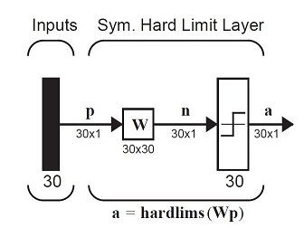

* Code for pattern recognition: ( [mnist_test_code.m](sup_hebb_learn/mnist_test_code.m) ), and using mnist.mat and funstions to load the data and labels.  
* In an autoassociative memory the desired output vector is equal to the input vector (i.e., tq = pq )  
     
   This model is used to store a set of patterns and then to recall them, even when corrupted patterns are provided as inputs.  
      
 * Performance graph: 
     
 * Screenshot of the code results:
      
___
#### Footnotes: 
* Additional Conceptual information(for personal reference):-

     Functions used in the final Matlab code ~
1. `trainscg` ----> [Scaled conjugate gradient backpropagation](https://in.mathworks.com/help/nnet/ref/trainscg.html)
   
     Syntax: 
  
            net.trainFcn='trainscg'
            
            [net,tr]=train(net,.....)
     It is a network training function that updates weight and bias values according to scaled conjugate gradient method.
     
     
     Also, the training stops for :
     
      x     Max. no of epochs (repetitions) is reached.
     
      x     Max. amount of time has reached.
     
      x     Performance is minimized to the goal.

2. `crossentropy` ----> [Neural network performance](https://in.mathworks.com/help/nnet/ref/crossentropy.html)

     Syntax: 
     
               perf = crossentropy(net,targets,outputs,perfWeights)

               perf = crossentropy(___,Name,Value)
     '**perf**' calculates a network performance given targets and outputs, with optional performance weights and other parameters.
     
     The function returns a result that heavily penalizes outputs that are extremely inaccurate (y near 1-t), with very little penalty for fairly correct classifications (y near t). Minimizing cross-entropy leads to good classifiers.
